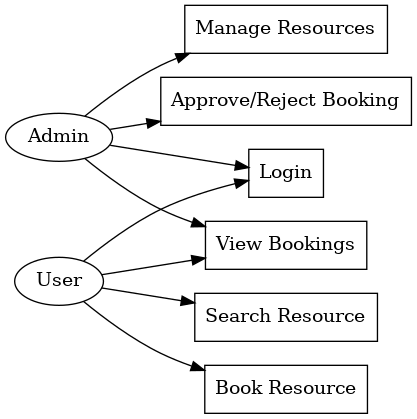
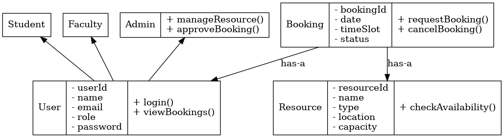

# Campus Resource Booking System

## 📌 Project Overview
The **Campus Resource Booking System** is a Java + DBMS-based application that helps students and faculty easily book and manage campus resources such as classrooms, labs, seminar halls, and sports facilities. The system ensures availability, avoids conflicts, and simplifies the approval process.

---

## 🎯 Features
- User login and authentication (Students, Faculty, Admin).
- Search and book available resources.
- View and cancel bookings.
- Admin can add/update resources.
- Admin can approve/reject booking requests.
- Database integration for storing resource and booking details.

---

## 🛠 Tech Stack
### Frontend
- HTML, CSS, JavaScript

### Backend
- Java (OOP concepts)
- Java Servlets / JSP
- JDBC for database connectivity

### Database
- MySQL (Booking & Resource tables)

---

## 📊 UML Diagrams
- Use Case Diagram ->  

- Class Diagram -> 
  

